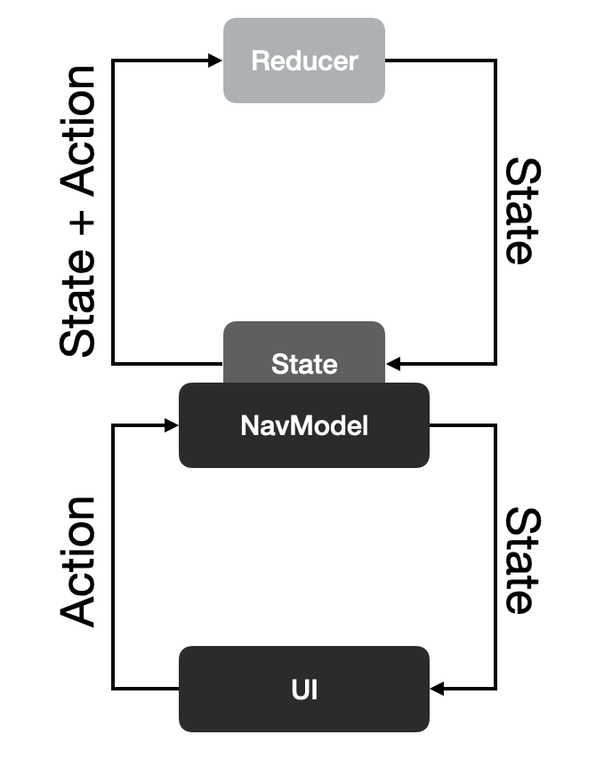

# Modo

[](https://repo1.maven.org/maven2/com/github/terrakok)
[](https://opensource.org/licenses/MIT)

Modo is navigation library for Jetpack Compose based on UDF principles for developing Single Activity applications.

<table>
    <tr>
        <td>
            
        </td>
        <td>
            
        </td>
        <td>
            
        </td>
    </tr>
    <tr>
        <td>
            Basic navigation
        </td>
        <td>
            MultiScreen navigation
        </td>
        <td>
            Nested navigation
        </td>
    </tr>
</table>

## The Main idea

* `NavigationState` defines UI
* UDF Navigation
* There are Screen and ContainerScreen
    * ContainerScreen can contains nad render child screens
    * There are several build in implementation of ContainerScreen like StackScreen and MultiScreen
* Whole navigation is Graph
* `NavigationState` can be changed by only by `dispatch(action)`
* You can easily extent existed commands by creating custom Actions and Reducers 



# Quick start

The best way to lear the library is discovering sample application. You can add Modo into your project doing folowing steps

1. Add gradle dependency. In your `build.gradle.kts`
    ```kotlin
    plugins {
        //...
        //for serialization screens
        id("kotlin-parcelize")
    }
    
    dependencies {
        implementation("com.github.terrakok:modo-compose:${latest_version}")
    }
    ```
2. Create your own stack screen
    ```kotlin
    @Parcelize
    class SampleStack(
        private val stackNavModel: StackNavModel
    ) : StackScreen(stackNavModel) {
    
        constructor(rootScreen: Screen) : this(StackNavModel(rootScreen))
    
        @Composable
        override fun Content() {
            TopScreenContent {
                SlideTransition()
            }
        }
    }
    ```
3. Create simple screen
    ```kotlin
    @Parcelize
    class SampleScreen(
        override val screenKey: ScreenKey = generateScreenKey()
    ) : Screen {
    
        @Composable
        override fun Content() {
            Text(text = "Hello world", modifier = Modifier.fillMaxSize())
        }
    }
    ```
4. Integrate screen with your
   1. For Activity
      ```kotlin
      class AppActivity : AppCompatActivity() {

        private var rootScreen: StackScreen? = null

        override fun onCreate(savedInstanceState: Bundle?) {
             super.onCreate(savedInstanceState)
            rootScreen = Modo.init(savedInstanceState, rootScreen) {
                  SampleStack(SampleScreen(1))
            }
            setContent {
                  Surface(color = MaterialTheme.colors.background) {
                      rootScreen?.Content()
                  }
              }
          }

          override fun onSaveInstanceState(outState: Bundle) {
              Modo.save(outState, rootScreen)
            super.onSaveInstanceState(outState)
          }

      }
      ```
   2. For Fragment
      ```kotlin
      internal class ModoRootFragment : Fragment() {

          private var rootScreen: ModoStackScreen? = null

          override fun onCreate(savedInstanceState: Bundle?) {
              super.onCreate(savedInstanceState)
              rootScreen = Modo.init(savedInstanceState, rootScreen) { ModoStackScreen() }
          }

          override fun onCreateView(inflater: LayoutInflater, container: ViewGroup?, savedInstanceState: Bundle?): View =
              ComposeView(requireContext()).apply {
                  setContent {
                      rootScreen?.Content()
                  }
              }

          override fun onSaveInstanceState(outState: Bundle) {
              super.onSaveInstanceState(outState)
              Modo.save(outState, rootScreen)
          }

      }
      ```

    

# BuildIn Container Screens
You can implement container screen by your own, but Modo provides several default containers
1. [StackScreen](modo-compose/src/main/java/com/github/terrakok/modo/stack) - stack navigation implementation 
 

2. [Multiscreen](modo-compose/src/main/java/com/github/terrakok/modo/multiscreen) - multiscreen navigation
 

Check out sample for more.

# License

```
MIT License

Copyright (c) 2021 Konstantin Tskhovrebov (@terrakok)

Permission is hereby granted, free of charge, to any person obtaining a copy
of this software and associated documentation files (the "Software"), to deal
in the Software without restriction, including without limitation the rights
to use, copy, modify, merge, publish, distribute, sublicense, and/or sell
copies of the Software, and to permit persons to whom the Software is
furnished to do so, subject to the following conditions:

The above copyright notice and this permission notice shall be included in all
copies or substantial portions of the Software.

THE SOFTWARE IS PROVIDED "AS IS", WITHOUT WARRANTY OF ANY KIND, EXPRESS OR
IMPLIED, INCLUDING BUT NOT LIMITED TO THE WARRANTIES OF MERCHANTABILITY,
FITNESS FOR A PARTICULAR PURPOSE AND NONINFRINGEMENT. IN NO EVENT SHALL THE
AUTHORS OR COPYRIGHT HOLDERS BE LIABLE FOR ANY CLAIM, DAMAGES OR OTHER
LIABILITY, WHETHER IN AN ACTION OF CONTRACT, TORT OR OTHERWISE, ARISING FROM,
OUT OF OR IN CONNECTION WITH THE SOFTWARE OR THE USE OR OTHER DEALINGS IN THE
SOFTWARE.
```
