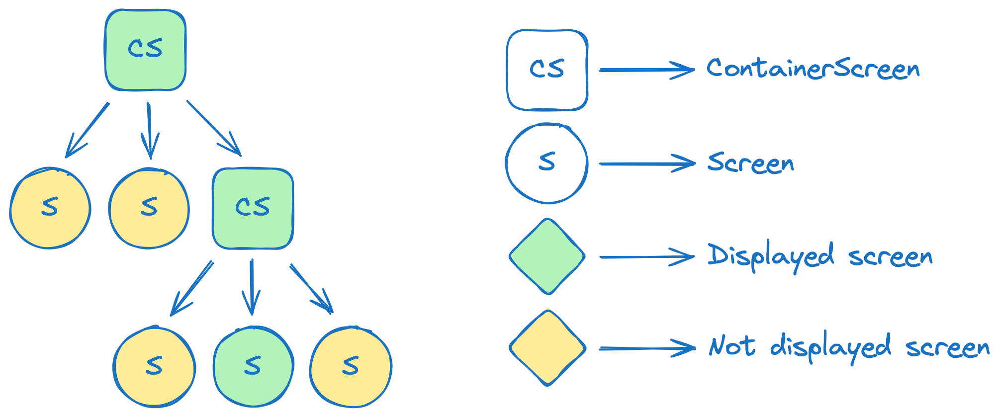

# [Modo](https://ikarenkov.github.io/Modo) - state-based Jetpack Compose navigation

[](https://repo1.maven.org/maven2/com/github/terrakok)
[](https://opensource.org/licenses/MIT)

Modo is a simple and convenient state-base navigation library for Jetpack Compose.

https://github.com/ikarenkov/Modo/assets/17216532/e2977736-bdda-44a9-83f3-379731ddfecc

## [Project website](https://ikarenkov.github.io/Modo)

Check out our website to get the most up-to-date information about the library:

* [**Modo overview**](https://ikarenkov.github.io/Modo/modooverview.html)
* [**Quick start guide**](https://ikarenkov.github.io/Modo/quickstartguide.html)
* [**Core concepts**](https://ikarenkov.github.io/Modo/core-concepts.html)
* [**How to integrate Modo in your app**](https://ikarenkov.github.io/Modo/how-to-integrate-modo-to-your-app.html)
* [**Features list**](https://ikarenkov.github.io/Modo/features.html)

## Navigation - is a graph

Each integration of Modo is a
<a href="https://en.wikipedia.org/wiki/Tree_(graph_theory)#Rooted_tree" summary="A rooted tree is a tree in which one vertex has been designated the root.">rooted tree (wiki)</a> that can be displayed:


* Each node - is a <code>Screen</code> or <code>ContainerScreen</code></step>
* Leafs nodes - are <code>Screen</code>s.</step>
* Inner nodes - are <code>ContainerScreen</code>s. They can contain other <code>Screen</code>s or <code>ContainerScreen</code>s in
  their <code>navigationState</code>.
* Root node - is a <code>RootScreen</code>. You can have multiply roots in your app. See <a href="https://ikarenkov.github.io/Modo/how-to-integrate-modo-to-your-app.html"> How to integrate Modo</a> for details.

## State defines UI

* `NavigationState` defines UI
    * Initial state is defined in constructor of `ContainerScreen` by `navModel: NavModel<State, Action>`
    * To update state, use `dispatch(action: Action)` on `NavigationContainer`, or build-in extension functions
      for [StackScreen](modo-compose/src/main/java/com/github/terrakok/modo/stack/StackActions.kt)
      and [MultiScreen](modo-compose/src/main/java/com/github/terrakok/modo/multiscreen/MultiScreenActions.kt)
* There are Screen and ContainerScreen
    * ContainerScreen can contain and render child screens
    * There are some build-in implementation of ContainerScreen like StackScreen and MultiScreen
* You can easily create custom `Action` by extending `Action` or `ReducerAction`,

# License

```
MIT License

Copyright (c) Konstantin Tskhovrebov (@terrakok)
          and Karenkov Igor (@KarenkovID)

Permission is hereby granted, free of charge, to any person obtaining a copy
of this software and associated documentation files (the "Software"), to deal
in the Software without restriction, including without limitation the rights
to use, copy, modify, merge, publish, distribute, sublicense, and/or sell
copies of the Software, and to permit persons to whom the Software is
furnished to do so, subject to the following conditions:

The above copyright notice and this permission notice shall be included in all
copies or substantial portions of the Software.

THE SOFTWARE IS PROVIDED "AS IS", WITHOUT WARRANTY OF ANY KIND, EXPRESS OR
IMPLIED, INCLUDING BUT NOT LIMITED TO THE WARRANTIES OF MERCHANTABILITY,
FITNESS FOR A PARTICULAR PURPOSE AND NONINFRINGEMENT. IN NO EVENT SHALL THE
AUTHORS OR COPYRIGHT HOLDERS BE LIABLE FOR ANY CLAIM, DAMAGES OR OTHER
LIABILITY, WHETHER IN AN ACTION OF CONTRACT, TORT OR OTHERWISE, ARISING FROM,
OUT OF OR IN CONNECTION WITH THE SOFTWARE OR THE USE OR OTHER DEALINGS IN THE
SOFTWARE.
```
