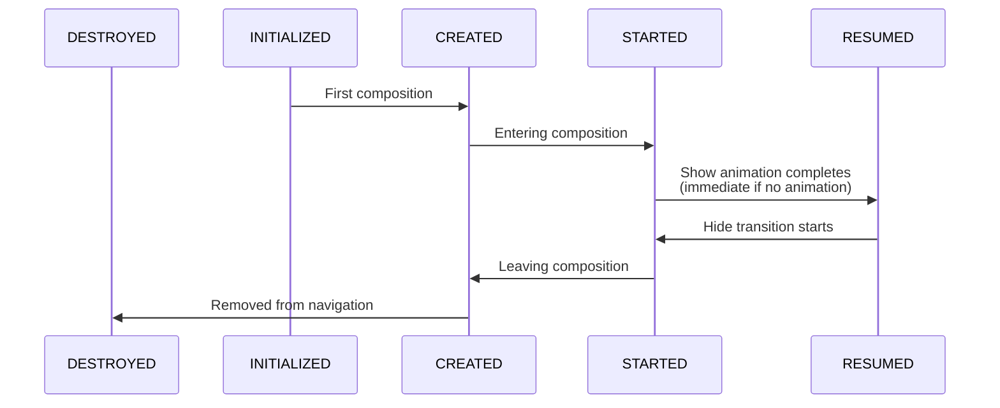
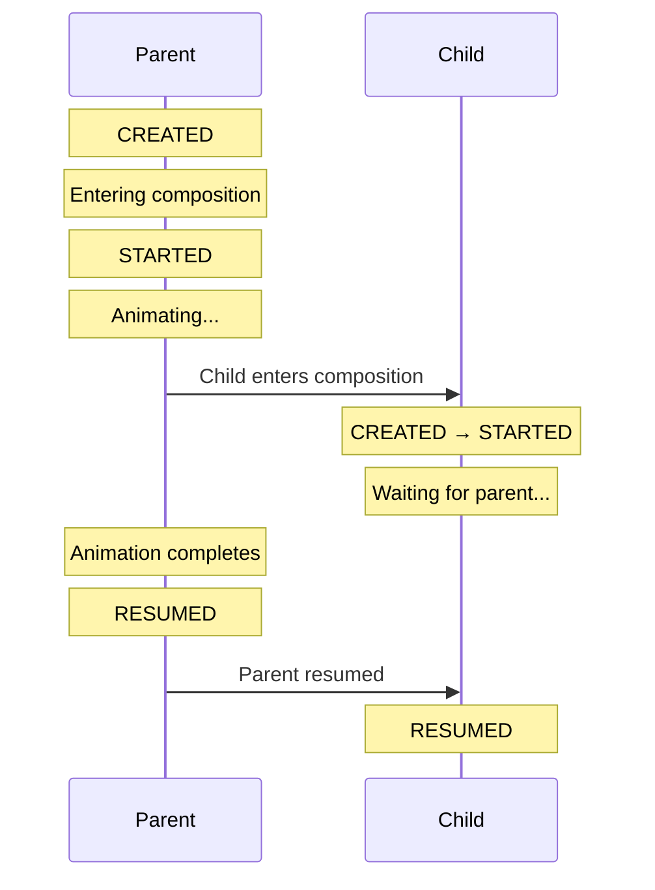
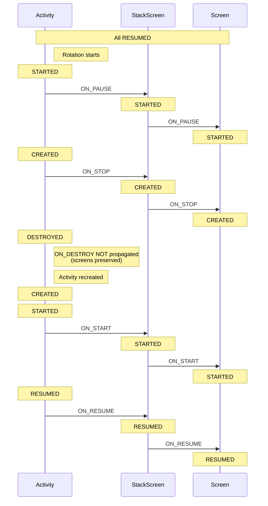

# Lifecycle

<show-structure for="chapter,procedure" depth="2"/>

This article covers the lifetime of screen instances and their integration with the Android Lifecycle.

## Screen Instance Lifecycle

Screen instances in Modo have a long lifetime:

- Screen instances live as long as your app process (not tied to Activity or Fragment lifecycle)
- The same instance survives recomposition and configuration changes (rotation, language change, etc.)
- Safe to inject into your DI container if its lifetime is shorter or equal to the screen

This is guaranteed when using `Modo.rememberRootScreen()` and similar built-in functions.

## Lifecycle Basics

Modo provides seamless [integration](%github_code_url%/modo-compose/src/main/java/com/github/terrakok/modo/android/ModoScreenAndroidAdapter.kt)
with Android Lifecycle. Each screen gets its own `LifecycleOwner` that can be retrieved by using `LocalLifecycleOwner`:

```kotlin
// Access via LocalLifecycleOwner (standard Compose API)
val lifecycleOwner = LocalLifecycleOwner.current
val lifecycleState by lifecycleOwner.lifecycle.currentStateAsState()

// Observe lifecycle events
DisposableEffect(lifecycleOwner) {
    val observer = LifecycleEventObserver { _, event ->
        when (event) {
            Lifecycle.Event.ON_RESUME -> {
                // Screen is ready for interactions
            }
            Lifecycle.Event.ON_PAUSE -> {
                // Screen is hiding
            }
            else -> {}
        }
    }
    lifecycleOwner.lifecycle.addObserver(observer)
    onDispose { lifecycleOwner.lifecycle.removeObserver(observer) }
}
```

{ collapsible="true" collapsed-title="How to access lifecycle in your screen" }

Screen lifecycle is controlled by three main factors:

- **Composition state**: Lifecycle responds to entering/leaving composition
- **Parent lifecycle**: Child state never exceeds parent state and can be updated by a parent (see
  [Parent-Child Lifecycle Coordination](#parent-child-lifecycle-coordination))
- **Transitions**: Screen can be resumed only after animations are complete (see [Transition Lifecycle Control](#transition-lifecycle-control))

Each screen progresses through the standard Android Lifecycle states:

<table>
<tr>
    <td><b>State</b></td>
    <td><b>Meaning</b></td>
</tr>
<tr>
    <td>INITIALIZED</td>
    <td>The screen is constructed (instance created) but has never been displayed.</td>
</tr>
<tr>
    <td>CREATED</td>
    <td>The screen was displayed at least once.</td>
</tr>
<tr>
    <td>STARTED</td>
    <td>The screen is in composition.</td>
</tr>
<tr>
    <td>RESUMED</td>
    <td>Ready for user interaction. The screen is STARTED, visible, and all transitions are complete.</td>
</tr>
<tr>
    <td>DESTROYED</td>
    <td>The screen is removed from the navigation graph, and all resources are cleaned up.</td>
</tr>
</table>

Screens move through states sequentially. Each transition happens when something changes in the screen's lifecycle:



> **Note**: Parent lifecycle can propagate events and limit child states.
> See [Parent-Child Lifecycle Coordination](#parent-child-lifecycle-coordination) for details.

## Parent-Child Lifecycle Coordination

The lifecycle of parent and child screens follows strict rules to ensure consistency:

### Rules

**Rule**: A child's lifecycle state never exceeds its parent's state.

```
Parent: RESUMED  →  Child can reach: RESUMED
Parent: STARTED  →  Child can reach: STARTED (blocked from RESUMED)
Parent: CREATED  →  Child can reach: CREATED (blocked from STARTED)
```

**Event Propagation from Parent**:

> **Note**: When a screen enters composition, it subscribes to its parent's lifecycle. Events are propagated from parent to child while the
> subscription is active (screen is in composition).

| **Parent Event** | **Propagation Behavior**                                                                                   |
|------------------|------------------------------------------------------------------------------------------------------------|
| `ON_CREATE`      | Never propagated (child subscribes after its own creation)                                                 |
| `ON_START`       | Always propagated → Child moves to STARTED                                                                 |
| `ON_RESUME`      | Propagated but gated by transitions and activation → Child moves to RESUMED only if all conditions are met |
| `ON_PAUSE`       | Always propagated → Child immediately moves to STARTED                                                     |
| `ON_STOP`        | Always propagated → Child immediately moves to CREATED                                                     |
| `ON_DESTROY`     | Conditionally propagated (blocked during config changes to preserve SavedStateRegistry)                    |

### Examples

#### Parent with transition, child without transition { collapsible="true" }



Even though the child has no animation, it waits at STARTED until the parent reaches RESUMED.

#### Screen Rotation (Configuration Change) { collapsible="true" }



During configuration changes, screens are preserved (not destroyed) and reattach to the new Activity instance.

## Transition Lifecycle Control

Screens animated by `ScreenTransition` cannot reach RESUMED state until the animation completes:

- **Without transition**: STARTED → RESUMED (immediate)
- **With transition**: STARTED → (animation playing) → RESUMED (after animation completes)

This indirectly affects nested screens because of [parent-child lifecycle propagation](#parent-child-lifecycle-coordination).

## Practical Examples

### Managing Keyboard

Show/hide keyboard based on screen visibility:

```kotlin
@Composable
fun LoginScreenContent(modifier: Modifier) {
    val lifecycleOwner = LocalLifecycleOwner.current
    val keyboardController = LocalSoftwareKeyboardController.current
    val focusRequester = remember { FocusRequester() }

    DisposableEffect(lifecycleOwner) {
        val observer = LifecycleEventObserver { _, event ->
            when (event) {
                Lifecycle.Event.ON_RESUME -> {
                    // Screen is fully visible, focus input and show keyboard
                    focusRequester.requestFocus()
                }
                Lifecycle.Event.ON_PAUSE -> {
                    // Screen is hiding, clear focus and hide keyboard
                    focusRequester.freeFocus()
                    keyboardController?.hide()
                }
                else -> {}
            }
        }
        lifecycleOwner.lifecycle.addObserver(observer)
        onDispose {
            lifecycleOwner.lifecycle.removeObserver(observer)
        }
    }

    TextField(
        value = text,
        onValueChange = { text = it },
        modifier = Modifier.focusRequester(focusRequester)
    )
}
```

## Debugging Screens Lifecycle

Enable logging to see lifecycle events:

```kotlin
ModoDevOptions.onScreenPreDisposeListener = { screen ->
    Log.d("Modo", "Screen pre-dispose: ${screen.screenKey}")
}

ModoDevOptions.onScreenDisposeListener = { screen ->
    Log.d("Modo", "Screen disposed: ${screen.screenKey}")
}
```